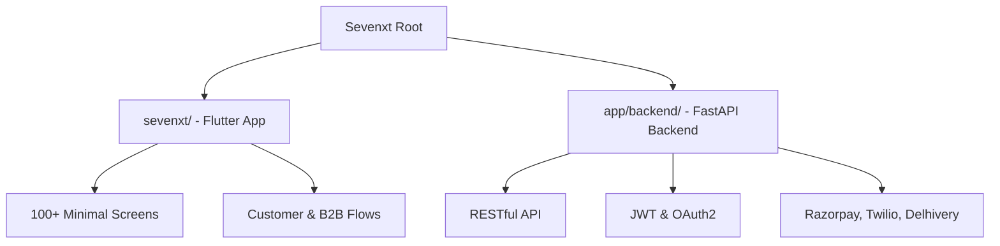

# Sevenxt Project Ecosystem

Sevenxt is a state-of-the-art e-commerce solution comprising a premium mobile frontend and a high-performance backend. This repository is organized as a monorepo containing both the application and its supporting infrastructure.

## Repository Structure

| Component | Directory | Description |
| :--- | :--- | :--- |
| **Frontend** | [`sevenxt/`](./sevenxt/) | Premium Flutter E-commerce UI Kit and Client App. |
| **Backend** | [`app/backend/`](./app/backend/) | FastAPI Python server handling business logic and integrations. |

## Quick Start

### Prerequisites
- **Frontend**: Flutter SDK, Android Studio/Xcode.
- **Backend**: Python 3.10+, PostgreSQL.

### Installation

1. **Backend**:
   Navigate to `app/backend/`, set up your `.env` file, and run `uvicorn main:app --reload`.
   See [Backend README](./app/backend/README.md) for details.

2. **Frontend**:
   Navigate to `sevenxt/`, run `flutter pub get`, and then `flutter run`.
   See [Frontend README](./sevenxt/README.md) for details.

## Core Integrations

- **Payments**: Razorpay
- **SMS/OTP**: Twilio
- **Logistics**: Delhivery
- **Auth**: JWT-based Secure Authentication

---
For detailed documentation on each component, please refer to the respective subdirectories.
